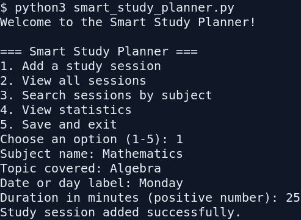
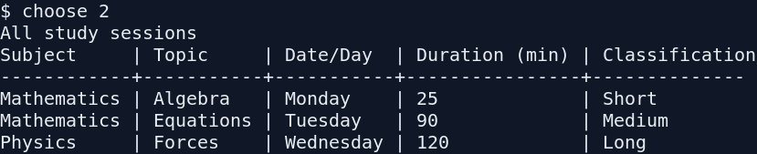
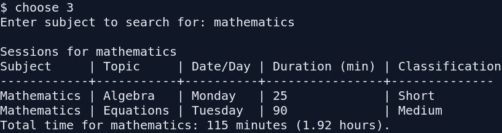
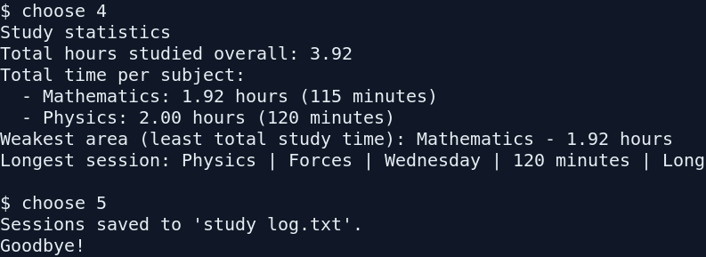

# Individual Assignment: The Smart Study Planner

## 1. Source-code link

The complete source code is in [`smart_study_planner.py`](smart_study_planner.py).
Once this branch is pushed to GitHub, the direct source link is:

<https://github.com/mikeo-ne/study-schedule-/blob/arena/01a07bc3-study-schedule/smart_study_planner.py>

## 2. Brief report

### Purpose

The Smart Study Planner is a menu-driven Python console application for
recording study sessions during a semester. A session records the subject,
topic, date or day label, and duration in minutes. The programme allows a
student to review all sessions, search by subject, and identify study patterns
from summary statistics.

### Main features

- A repeating five-option menu with a clear response to invalid choices.
- Positive-number validation for session duration, including re-prompting for
  non-numeric, zero, negative and non-finite values.
- Centralised `classify_session()` logic: Short is under 30 minutes, Medium is
  30 through 90 minutes, and Long is over 90 minutes.
- Formatted tables for all sessions and case-insensitive subject searches.
- Search totals in both minutes and hours.
- Statistics for overall hours, time per subject, the least-studied subject,
  and the longest individual session.
- Persistent storage in `study log.txt`. The file is loaded on start-up and
  saved when the user selects Save and exit. A missing or invalid file does not
  crash the programme.

### Design and code quality

The solution is split into small, named functions rather than placing all
logic in `main()`. The shared `sessions` list is used by the interactive
programme, while optional list parameters make the display and calculation
functions reusable. Comments explain the case-insensitive subject grouping and
the first-run file behaviour. The entry point is protected by:

```python
if __name__ == "__main__":
    main()
```

## 3. Step-by-step operation evidence

The screenshots below were produced from the implemented programme using a
fresh data file. The corresponding interaction is also written out here so
that the exact test steps remain readable in source control.

### Step 1 — Start-up and add a session

Run `python3 smart_study_planner.py`, choose `1`, and enter:

- Subject: `Mathematics`
- Topic: `Algebra`
- Date/day: `Monday`
- Duration: `25`

The programme confirms that the session was added. The duration is classified
as **Short** when displayed.



### Step 2 — Add boundary examples and view all sessions

Add two more sessions with durations `90` and `120`, then choose `2`. The
formatted table shows **Medium** for 90 minutes and **Long** for 120 minutes.



### Step 3 — Search by subject

Choose `3` and enter `mathematics` in lower case. Both Mathematics sessions
are returned, demonstrating case-insensitive matching, and their combined
time is displayed. Searching for a subject with no records produces a clear
“No sessions found” message instead of an empty table.



### Step 4 — View statistics and save

Choose `4` to view overall hours, per-subject totals, the weakest area and the
longest session. Choose `5` to save and exit. A `study log.txt` file is then
created. Starting the programme again loads those saved records before the
menu appears.



## 4. Test data used for the evidence

| Subject | Topic | Date/day | Duration |
|---|---|---|---:|
| Mathematics | Algebra | Monday | 25 minutes |
| Mathematics | Equations | Tuesday | 90 minutes |
| Physics | Forces | Wednesday | 120 minutes |

This set covers all three classifications, repeated subjects, a
case-insensitive search, per-subject aggregation, the weakest-area result and
the longest-session result.
